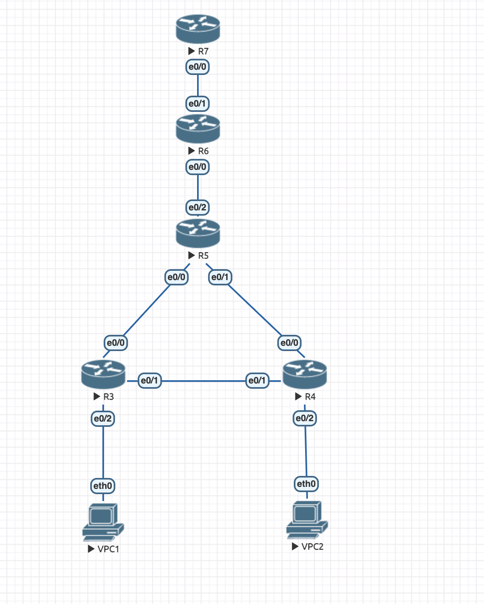
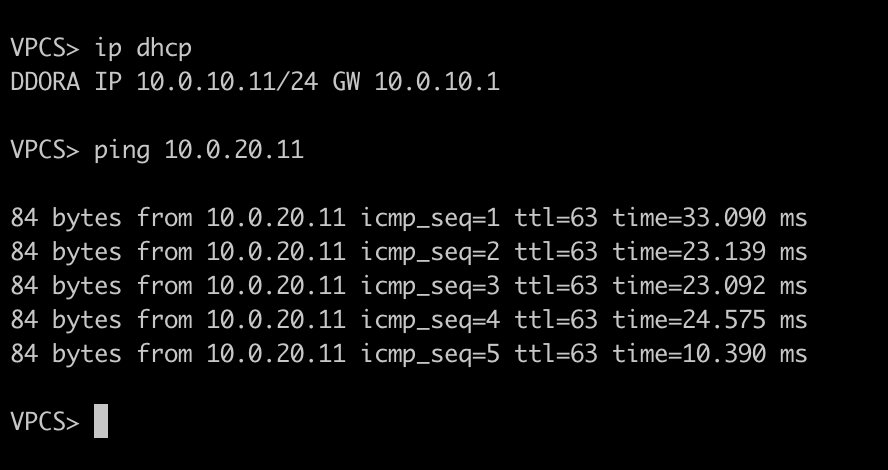
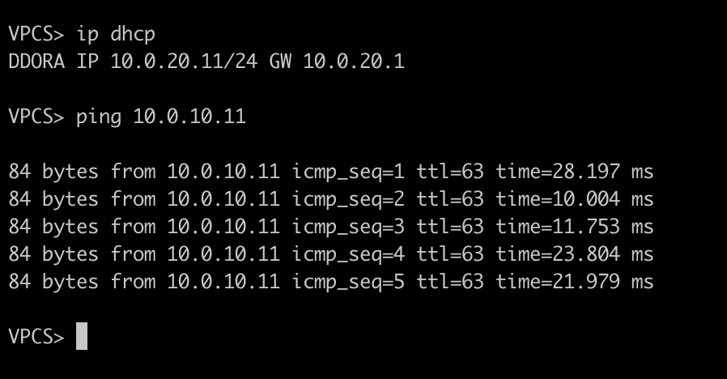

Делал на основе документаций отсюда:

https://www.computernetworkingnotes.com/ccna-study-guide/how-to-configure-dhcp-server-on-cisco-routers.html
https://habr.com/ru/post/108931/

**Топология сети**

**Проверка работоспособности:**

